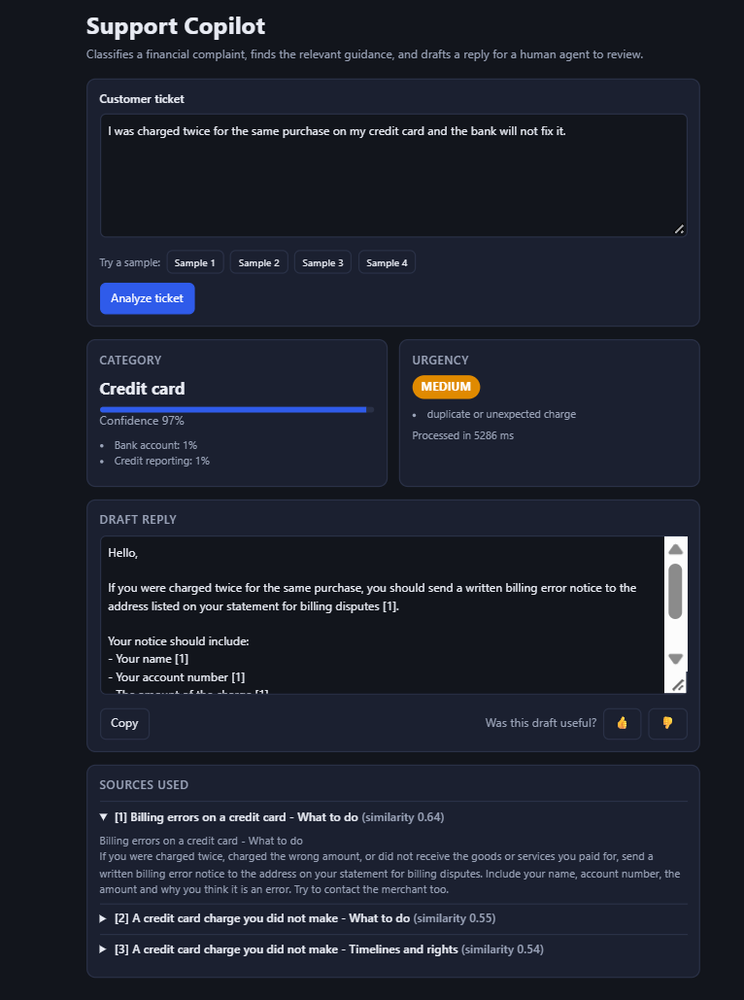
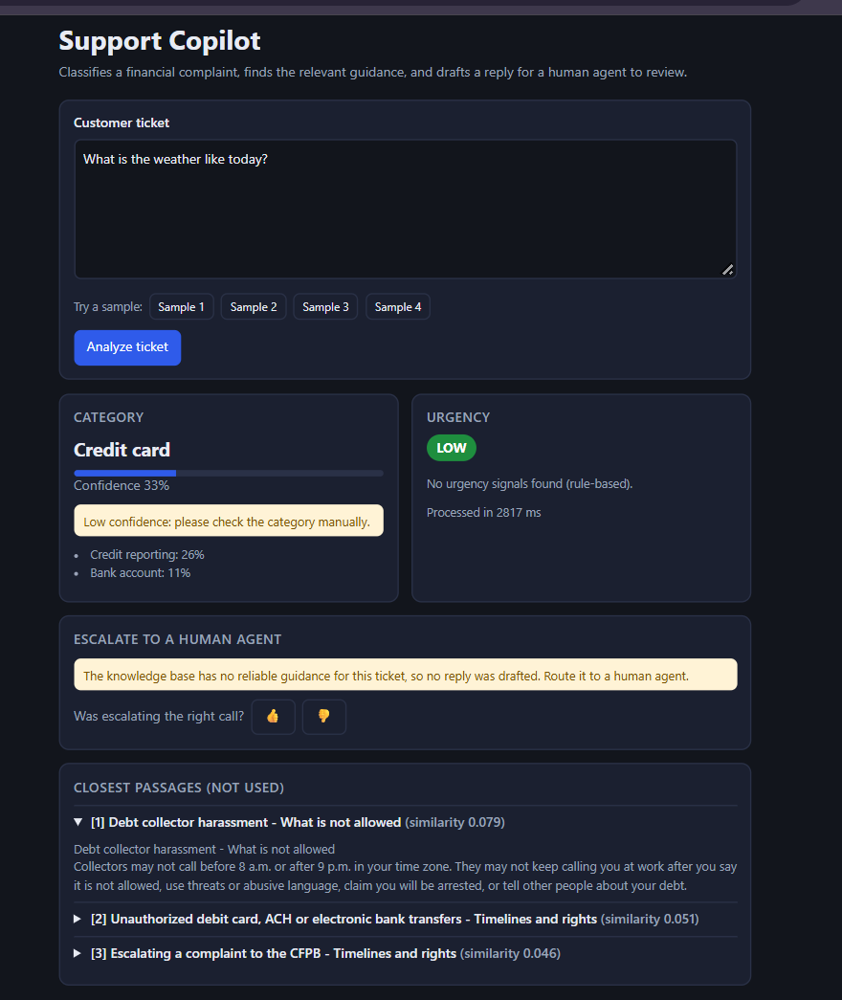

# Support Copilot

An AI assistant for financial customer-support agents. It reads a customer complaint, **classifies** it, flags **urgency**, **retrieves** the relevant guidance from a knowledge base (RAG), and **drafts a cited reply** for a human to review. When the knowledge base cannot support an answer, it **refuses and escalates** instead of guessing.

**Live demo:** _(add your link after deploying)_

| A normal ticket | A ticket the system refuses |
|---|---|
|  |  |

## How it works

```
React dashboard  --POST /analyze-->  FastAPI backend
                                       |- TF-IDF + Logistic Regression  -> category + confidence
                                       |- keyword rules                 -> urgency + reasons
                                       |- ChromaDB vector search        -> top-3 passages + distance
                                       |     '- distance > 0.60 ?       -> escalate to a human, no LLM call
                                       '- Gemini (free tier)            -> draft reply citing [1] [2] [3]
React shows: category + confidence, urgency, editable draft, sources, thumbs up/down feedback
```

## Results

**Data:** 20,000 randomly sampled real complaints from the public [CFPB Consumer Complaint Database](https://www.consumerfinance.gov/data-research/consumer-complaints/) (June 2025 to May 2026). After removing missing values, **8,749 duplicates** and near-empty texts, and merging 11 products into 7 classes, **11,188 complaints** remained (60% are credit reporting). Split 70/15/15, stratified: 7,831 train, 1,678 validation, 1,679 test.

### Classifier

Main metric: **macro-F1**, because plain accuracy is misleading on imbalanced data (always guessing the biggest class already gives 0.603 accuracy but only 0.107 macro-F1).

| Model | Accuracy | Macro-F1 |
|---|---|---|
| Always predict the majority class (validation) | 0.603 | 0.107 |
| **TF-IDF + Logistic Regression** (validation) | 0.850 | **0.760** |
| DistilBERT fine-tuned, best of 3 epochs (validation) | 0.842 | 0.750 |
| Ensemble of both, 50/50 (validation) | 0.852 | 0.762 |
| **TF-IDF + Logistic Regression, final test set** | **0.864** | **0.800** |

The test set was evaluated once, after all choices were made on validation. Test F1 per class: credit reporting 0.93, mortgage 0.92, bank account 0.82, credit card 0.80, debt collection 0.77, loans 0.69, money transfer/prepaid 0.68. Small classes move a lot (mortgage has only 48 test examples), so validation (0.760) and test (0.800) differ by chance as well as by data.

### Confidence score

The confidence is the classifier's top probability. Accuracy on the validation set rises steadily with it (from 36% in the lowest band to about 96% above 0.8), so the score is informative. Tickets below a threshold are flagged "check the category manually". I chose **0.50** on the validation set:

| Flag below | Tickets flagged | Accuracy of the rest | Mistakes caught |
|---|---|---|---|
| 0.4 | 7.2% | 88.0% | 25.5% |
| **0.5 (chosen)** | **14.7%** | **90.4%** | **45.4%** |
| 0.6 | 23.8% | 91.9% | 58.6% |
| 0.7 | 35.6% | 93.7% | 72.9% |

Overall validation accuracy is 85.0%, so flagging about 1 ticket in 7 lifts the rest to 90.4%. On a separate set of 21 hand-written tickets, predictions with confidence of 0.5 or more were correct 18 of 18 times (19 of 21 overall). That set is tiny and labelled by one person, so treat it as a sanity check only.

### Retrieval (RAG)

| Question set | hit@1 | hit@3 | Out-of-scope refused |
|---|---|---|---|
| **Holdout** (14 fresh questions) | **9/10** | **10/10** | **4/4** |
| Development (22 questions) | 18/18 | 18/18 | 4/4 |

The development set is **inflated**: two knowledge-base documents were rewritten after its failures. The holdout set is the fair number. Distances are cosine distances (lower = closer): the worst in-scope holdout question scored 0.573 and the closest question the knowledge base does not cover scored 0.693. The refusal limit is 0.60. The gap is narrow, which is why it was not raised to 0.70.

Latency in my runs: about 0.6 s when the system refuses (no LLM call), and a few seconds when Gemini drafts a reply (one run took 5 s; it varies with Gemini's load).

### Automated tests

35 tests: 34 pass and 1 is an expected failure that documents a known limitation (the urgency rules do not understand negation, so "I am not claiming fraud" still matches "fraud").

## Key findings and decisions

- **A clean dataset hid the problem.** On the templated Bitext support dataset, a baseline scored 99.7% accuracy, but only 11 of 22 (50%) on realistic hand-written messages. That is why the project uses real CFPB complaints.
- **DistilBERT did not beat the simple baseline** (0.750 vs 0.760 macro-F1, within noise for small classes), and averaging the two gained only 0.002. I deployed the lighter TF-IDF model: faster, no PyTorch on the server, and explainable.
- **Both models fail on the same tickets.** Many complaints labelled "credit reporting" describe debts, loans or cards, because consumers choose the product label themselves. Label overlap limits accuracy more than the choice of model does.
- **Training and serving share one cleaning function** (`backend/app/textclean.py`) to avoid train/serve skew.
- **Three layers against made-up answers:** a distance limit that skips the LLM when retrieval is weak, a prompt that allows only the numbered passages and demands citations (or `INSUFFICIENT_CONTEXT`), and a human who reviews every draft.
- **Urgency is rule-based on purpose.** The dataset has no urgency labels, so every decision shows its matched reasons instead of pretending a model learned it.

## Tech stack

| Part | Technology |
|---|---|
| Classifier | scikit-learn (TF-IDF + Logistic Regression), joblib |
| Experiment | DistilBERT fine-tuning (PyTorch, Hugging Face Transformers) on a Colab T4 GPU |
| Retrieval | ChromaDB, all-MiniLM-L6-v2 embeddings (ONNX), cosine distance |
| LLM | Google Gemini API (free tier) with a backup model, timeout and fallback |
| Backend | FastAPI, Pydantic, Uvicorn |
| Frontend | React + Vite |
| Packaging | Docker |
| Tests | pytest |

## Project structure

```
ml/                  prepare_data.py, train_baseline.py, finetune_distilbert.py,
                     confidence_analysis.py, common.py, results/
knowledge_base/      18 short guidance documents (one chunk per "## section")
backend/app/         main.py (API), classify.py, urgency.py, rag.py, llm.py,
                     messages.py, ratelimit.py, config.py, textclean.py
backend/eval/        eval_set.json, eval_holdout.json, run_eval.py,
                     classifier_samples.json, test_classifier.py, try_ticket.py
backend/tests/       pytest tests
backend/models/      ticket_classifier.joblib + .meta.json
frontend/            React dashboard
Dockerfile           backend image for deployment
```

## Run it locally

Tested on Windows with Python 3.13. Commands below are for PowerShell; on macOS/Linux, activate the environment with `source venv/bin/activate`.

### 1. Setup

```powershell
python -m venv venv
venv\Scripts\Activate.ps1
python -m pip install -r ml/requirements-ml.txt
python -m pip install -r backend/requirements-dev.txt
```

### 2. Train the classifier

The training data is not stored in this repository. Re-create it by streaming a sample of the CFPB dataset (Hugging Face: `Mouwiya/cfpb-consumer-complaints`) into `data/cfpb_raw_sample.csv`, then:

```powershell
python ml/prepare_data.py        # cleans -> data/cfpb_clean.csv
python ml/train_baseline.py      # trains, prints validation + test, saves the model
python ml/confidence_analysis.py # accuracy by confidence level (validation set)
```

The trained model is already included in `backend/models/`, so you can skip this step and just run the app.

### 3. Backend

```powershell
cd backend
Copy-Item .env.example .env       # then add your free key from https://aistudio.google.com
python build_index.py             # builds the vector index (first run downloads ~80 MB once)
python -m eval.run_eval eval_holdout.json
python -m uvicorn app.main:app --reload --port 8000
```

Open http://localhost:8000/docs to try the API. Without a Gemini key the app still works and shows the top guidance passage instead of a written reply.

### 4. Frontend

```powershell
cd frontend
Copy-Item .env.example .env.local
npm install
npm run dev
```

### 5. Tests and tools

```powershell
cd backend
python -m pytest                       # 35 tests
python -m eval.try_ticket              # type a ticket, see the whole pipeline (no LLM call)
python -m eval.test_classifier         # 21 hand-written tickets
```

## API

| Endpoint | Purpose |
|---|---|
| `GET /health` | Status, number of indexed chunks, whether the classifier and LLM are configured |
| `POST /analyze` | Body: `{"text": "..."}` (5 to 5000 characters). Returns the analysis |
| `POST /feedback` | Agent thumbs up/down |

Abridged `/analyze` response:

```json
{
  "category": "CREDIT_CARD",
  "category_confidence": 0.88,
  "category_low_confidence": false,
  "urgency": "medium",
  "urgency_reasons": ["duplicate or unexpected charge"],
  "sources": [{ "title": "Billing errors on a credit card", "distance": 0.37, "similarity": 0.63 }],
  "draft": "Please send a written billing error notice... [1]",
  "status": "llm",
  "message": "",
  "needs_human": false
}
```

`status` is one of `llm`, `insufficient_context`, `low_retrieval_confidence`, `extractive_no_api_key`, `extractive_llm_error`, `extractive_daily_limit`. When the system refuses, `draft` is `null` and `message` explains why.

## Configuration (`backend/.env`)

| Variable | Default | Meaning |
|---|---|---|
| `GEMINI_API_KEY` | empty | Free key from Google AI Studio. Never commit `.env` |
| `GEMINI_MODEL` / `GEMINI_FALLBACK_MODELS` | `gemini-flash-latest` / `gemini-flash-lite-latest` | Main model and backups, tried in order |
| `LLM_TIMEOUT_SECONDS` | 20 | Give up on one Gemini call after this long |
| `TOP_K` | 3 | Passages retrieved |
| `MAX_DISTANCE` | 0.60 | Refuse when the nearest passage is farther than this |
| `LOW_CLASSIFIER_CONFIDENCE` | 0.50 | Flag the category below this confidence |
| `RATE_LIMIT_PER_MINUTE` | 20 | Per visitor address (0 = off) |
| `MAX_LLM_CALLS_PER_DAY` | 200 | After this, the app shows the top passage instead of calling Gemini (0 = off) |
| `STORE_TICKET_TEXT` | false | If false, feedback stores only a hash and lengths, not ticket text |
| `ALLOWED_ORIGINS` | localhost:5173 | Pages allowed to call the API. Set your real frontend URL when deploying |

## Deploy (free tiers)

- **Backend:** create a Web Service on Render from this repository (it uses the root `Dockerfile`). Set `GEMINI_API_KEY` and `ALLOWED_ORIGINS=<your frontend URL>`. Free instances sleep when idle and keep no permanent disk, so feedback is lost on restart.
- **Frontend:** import the repository into Vercel or Netlify, set the root directory to `frontend`, and set `VITE_API_URL` to the backend URL.

## Privacy and safety

- Do not send real personal data: the Gemini free tier may use submitted content to improve Google's products.
- By default no ticket or draft text is saved. Feedback stores a short hash, the lengths, the category and the rating.
- Every reply is a **draft**. A human agent must review it.
- The knowledge base is general US consumer-finance guidance written for this project. It is **not legal advice** and not any company's policy. Verify it against official sources before relying on it.

## Limitations

- **Label noise and overlap** cap accuracy (about 85%); money transfer/prepaid is the weakest class.
- **No "other" class:** an off-topic ticket still gets a category guess. The low-confidence flag and the retrieval refusal are the protection.
- **Company names leak the label** (for example Equifax or PayPal). A robustness test would remove them and measure the drop.
- **Retrieval sees only the ticket text and returns 3 passages,** so a useful section (for example a deadline) can be missing from the draft. A reranker or more passages would help.
- **Evaluation sets are small** (14, 22 and 21 items), so the percentages are rough, and the distance limit is tuned on few questions.
- **Answer quality is not measured:** the evaluations test retrieval only, not whether drafts are faithful to their sources.
- **Urgency rules** are unvalidated, English only, and ignore negation.
- **The Gemini free tier** has rate limits and occasional overload (503/504); the app falls back to a backup model, then to the top passage.

## Next steps

- Measure answer faithfulness with an LLM-as-judge and a larger, labelled question set.
- Add a reranker, retrieve more passages, and boost passages matching the predicted category.
- Add an "other" class and test robustness without company names.
- Store feedback in a database and use it to improve the system.
- Add continuous integration that runs the tests and the retrieval evaluation on every push.

## Data source and acknowledgements

Complaint data: US Consumer Financial Protection Bureau (public data). This project was built with the help of an AI assistant (Claude) for code and documentation; the training runs, evaluations and debugging were done and verified by the author.